# FitUp - Customizable Workout Builder

## Deployed Website:
[http://project-two-2020.herokuapp.com/](http://project-two-2020.herokuapp.com/)

## DESCRIPTION
Regardless of where you are, it's easy to keep up with your workout goals, all thanks to **FitUp**! Based on your location and desired muscle group(s), FitUp provides recommendations for nearby parks and gyms, along with possible exercises for your next workout. Build, store, and recall your workouts, all from the comfort of your home, or on-the-go! **FitUp**, the easy way to live your healthy lifestyle!

## SCREENSHOTS

### Login and Signup Pages
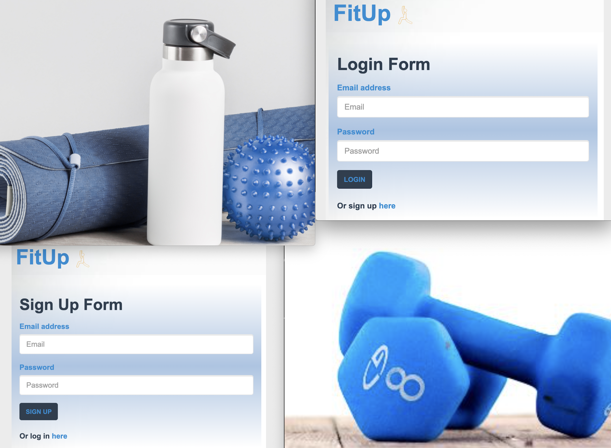
### Selection: Exercise Category and Location
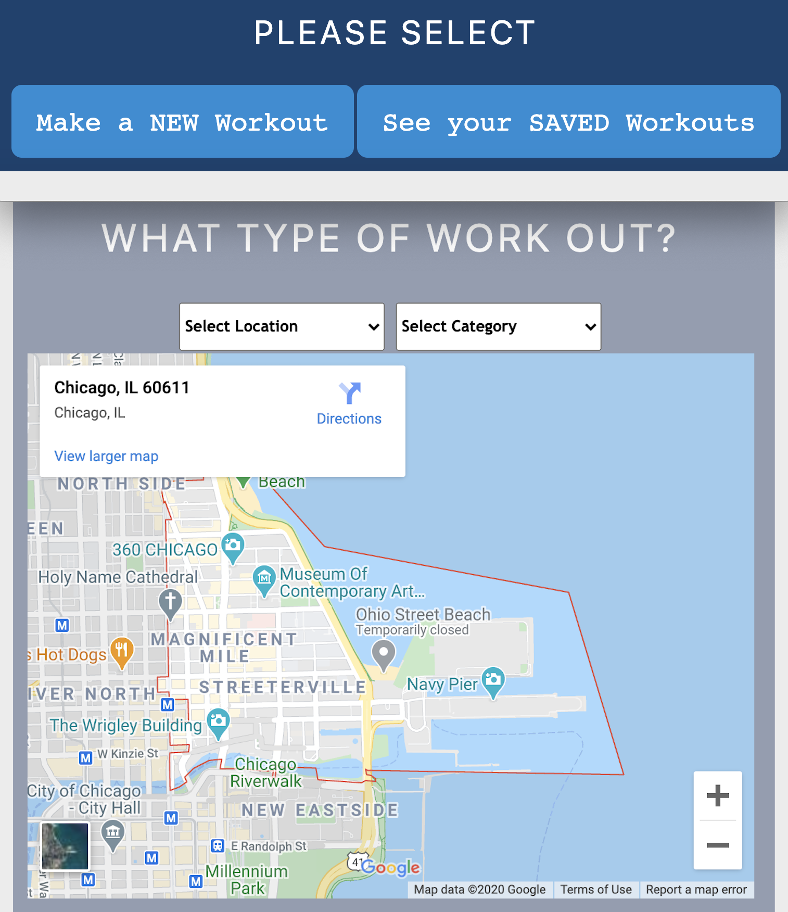
### Selection: Individual Exercises - Indoor, Gyms
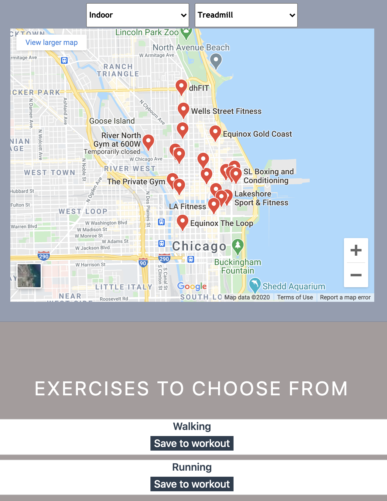
### Selection: Individual Exercises - Outdoor, Parks
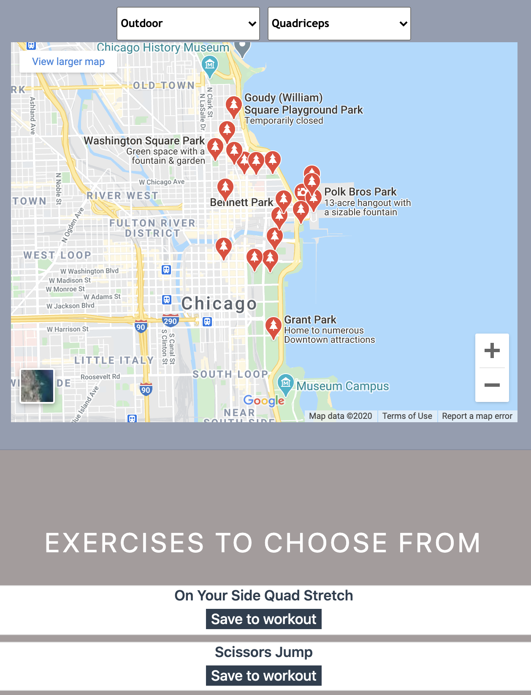
### Built Workout (Collection of Exercises)
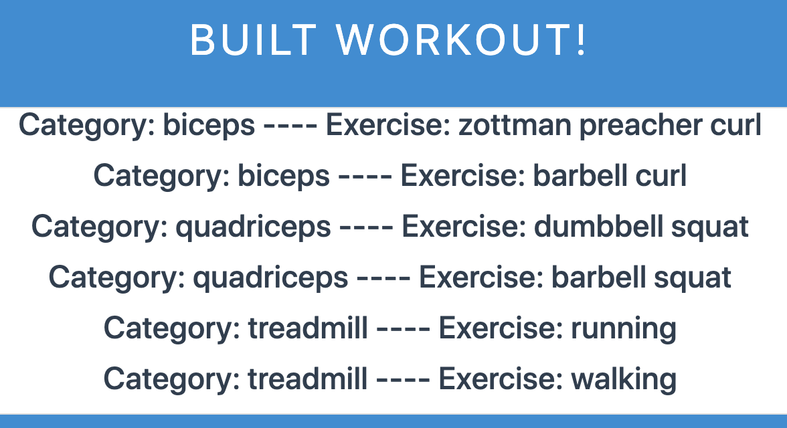
### Recalling Saved Workouts
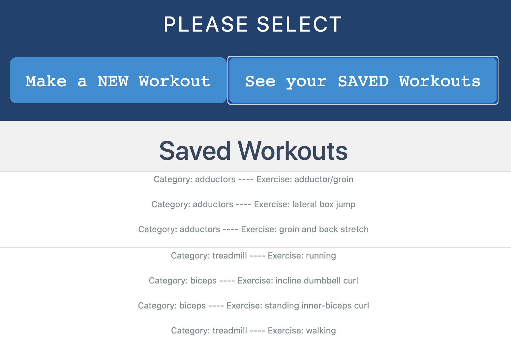

## TABLE OF CONTENTS
* [Installation](#installation)
* [Usage](#usage)
* [Tests](#tests)
* [License](#license)
* [Contributing](#contributing)
* [Questions](#questions)
* [Retrospective](#retrospective)

## INSTALLATION
- No installation is required, as the user can simply visit the deployed application link: [http://project-two-2020.herokuapp.com/](http://project-two-2020.herokuapp.com/)
- However, if the user wishes to investigate the code locally, the following steps should be performed:
    - Clone the repo for use on your local machine
    - Use the command line to locate the cloned repo and make it your current directory
    - Type `npm install` in the command line
    - This will install the necessary node module packages and dependencies

## USAGE
- To run the application locally...
    - Use the command line to locate the cloned repo and make it your current directory
    - Simply type `node server.js` in the command line
    - Executed correctly, the command line should respond with `Server listening on http://localhost:####`
    - Open your preferred browswer and visit `http://localhost:####/`
    - In both instances above, replace `####` with the corresponding PORT number as noted in the server.js file
    - To end the server instance, simply type "ctrl" + "c"
- To run the application online, please visit the deployed link: [http://project-two-2020.herokuapp.com/](http://project-two-2020.herokuapp.com/)
- Application functionality is identical whether you are running the server locally or visiting the deployed link:
    - After arriving at the landing page, new users have the ability to sign-up and log-in, and existing users have the ability to simply log-in
    - Following logon, the user is taken to the main page of the application, where they can choose to generate a new workout or view their previously saved workouts
    - When generating a new workout:
        - The user selects a location (indoor or outdoor), which yields nearby gyms or parks, respectively
        - The user selects a muscle group
        - Based on the previously selected inputs (location and muscle group), the returned results are a randomly generated list of possible exercises
        - Each of the exercises can be added to comprise a complete workout
        - Once the workout is built, it can be saved to the database
    - When recalling a saved workout:
        - The user is simply presented with all of their previously built workouts
        - The user can choose to remove a workout, if they so choose

## TESTS
While exercise selection and saved workout data are not location specific, the map features ***are*** location dependent. As such, in order to confirm our product's functionality, we sent the application to friends and colleagues around the world. They successfully verified that nearby parks and gyms were generated in Amsterdam, the UAE, Kazakhstan, and more!

Beyond that, we acknowledge that not everyone will be accessing our product from the same device or browser. As such, we tested our product on tablets, phones, and desktop computers, utilizing differnet browsers for each attempt.

### Gyms in Amsterdam
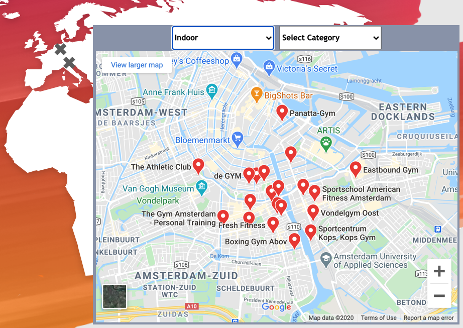
### Gyms in the UAE
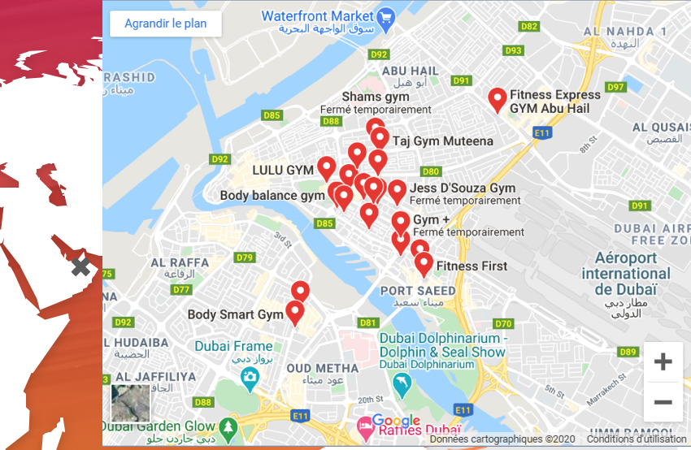
### Gyms in Kazakhstan
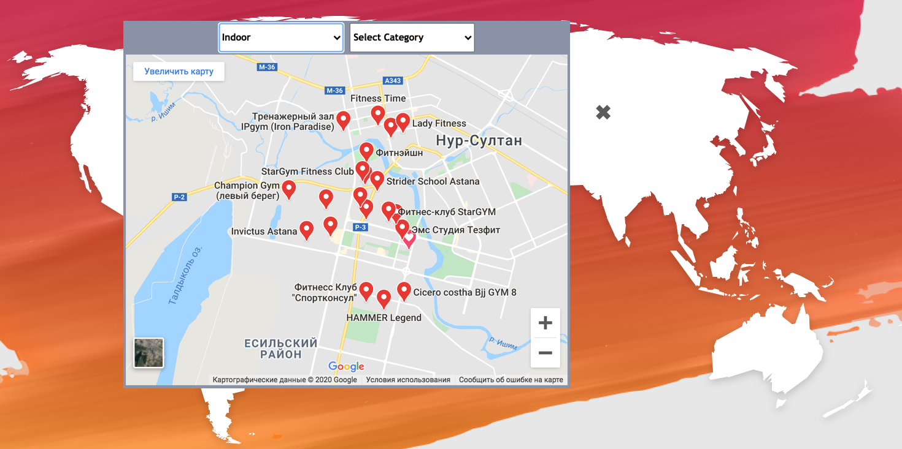
### Phone Access
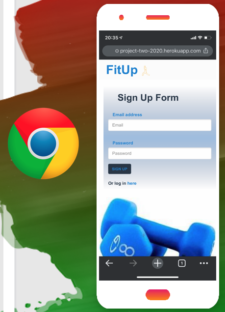
### Table Access
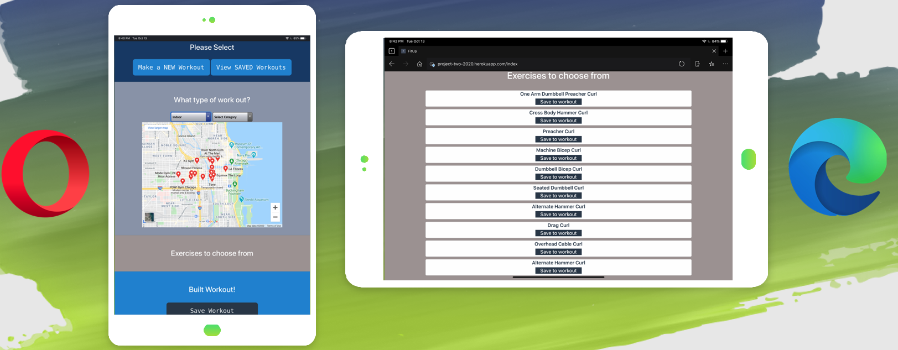
### Computer Access
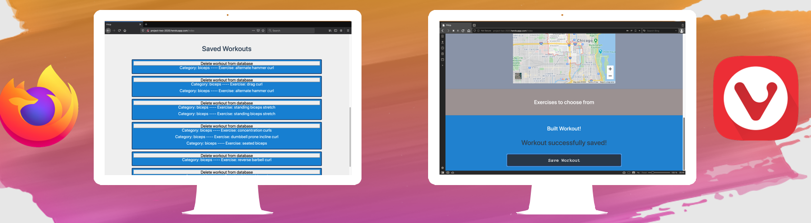

## LICENSE
License: MIT License 
[https://opensource.org/licenses/MIT](https://opensource.org/licenses/MIT)

## CONTRIBUTING
- [https://github.com/JPBrickhouse](https://github.com/JPBrickhouse)
- [https://github.com/JonMisner](https://github.com/JonMisner)
- [https://github.com/Mariafcc](https://github.com/Mariafcc)
- [https://github.com/kbaur775](https://github.com/kbaur775)

## QUESTIONS
For further questions, please reach out of the contributors as noted above!

## RETROSPECTIVE

### API / Database
Existing sources of workouts didn’t pan out as we had originally hoped, as there was insufficient data, or the APIs were difficult to access. But during our search, we came across a raw list of alphabetized exercises with associated muscle groups. From there, we built a small javascript function to read the file, parse through the data, assign an id, exercise name, and category (muscle group), and convert the parsed data into JSON. We took another pass through the JSON file and assigned a location for the exercises - indoor, outdoor, or both. We kept the JSON file handy, but also converted it into a CSV file and imported it into our MySQL database under a table called “Exercises.” On the subject of databases, we were able to keep the overall structure pretty lean. Beyond the "Exercises" table, we only had two other tables: The "Users" table stored ids, emails, passwords, to be referenced when storing and recalling all of the user-created workouts. The other table was the "Workouts" themselves, and one of the biggest challenges was finding a way to efficiently store a potentially unlimited number of exercises associated with one single workout. Originally, we considered using an array, but it turns out that MySQL doesn’t let you store arrays in table columns. However, MySQL ***does*** let you store JSON objects in table columns. Therefore, we could create key-value pairs, where the value was an array. So, we created a key called “workout”, the value associated with that key is always an array of exercise IDs. All of the API routes and AJAX calls ultimately result in the data you see on the page: user information and associated workouts, consisting of individual exercises, stored by their ids.

### Handlebars
Handlebars, while a powerful template engine, did not serve us in a capacity as we had originally hoped. One of the issues we uncovered is that Handlebars requires information to be fully acquired prior to rendering a full page. However, our application interface was based around a single-static page, where the individual components dynamically re-generated; we did not want to reload the page for each step in our exercise/workout-building process. We still utilized basic Handlebars templating and partials to load the "build a new workout" and "saved workout" pages, but since Handlebars was not able to load and render the individual components, we opted to utilize other methods.

### Future Features (2.0)
Given the time contraints of this project, we had to pause on implementing some of our desired features. However, several of these will be incorporated in the near-term future.
- Incorporate a social aspect, wherein users can post and share their workouts with others
- Allow for different difficulty levels (reps/sets) associated with the exercise / workout generator
- Tracked progress / fitness goals
- Additional map features, including trail routes, bike paths, etc.
- Timers for cardio workouts and rest periods between strength exercises
- Incorporating a music API, so individuals can listen to tunes while they workout